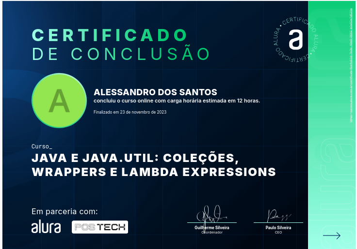
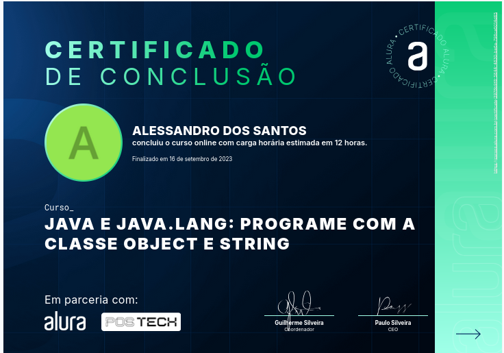
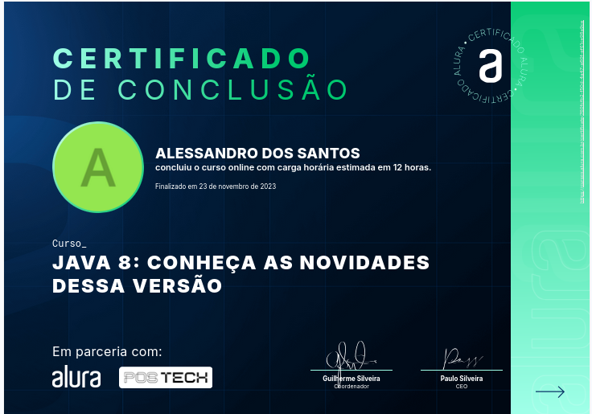
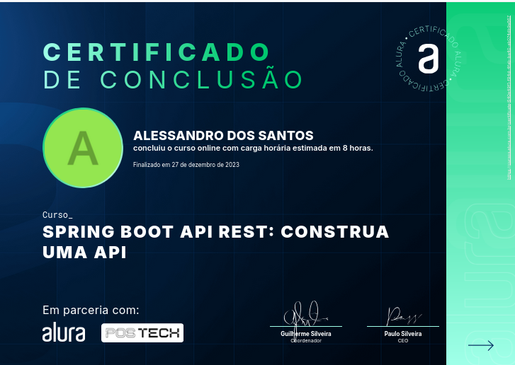
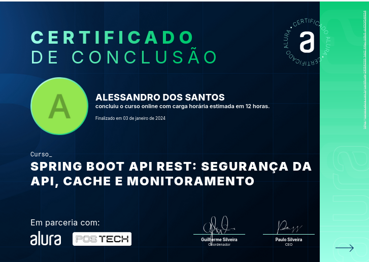
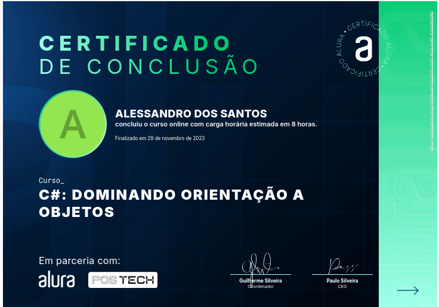
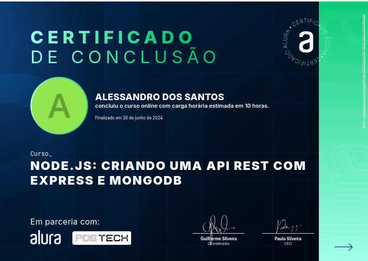
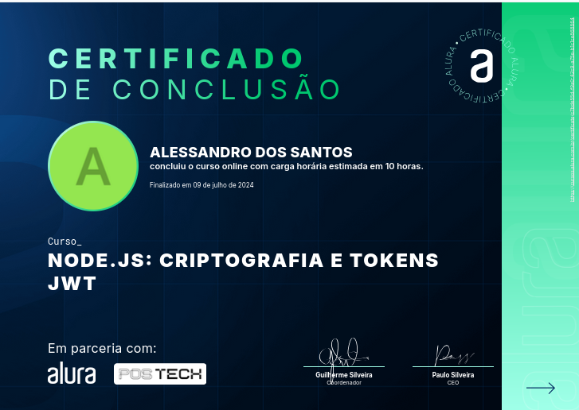
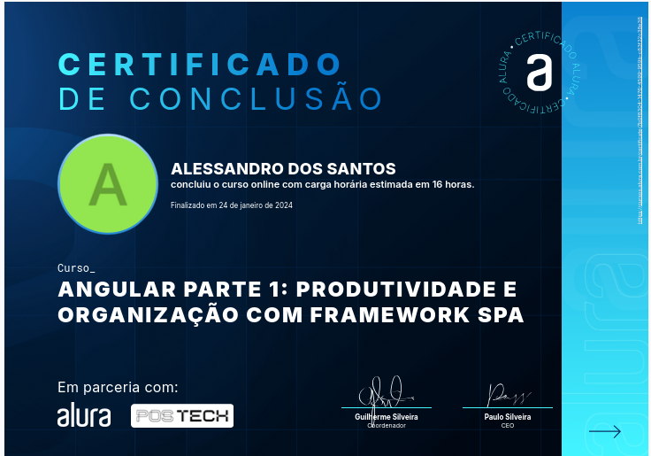
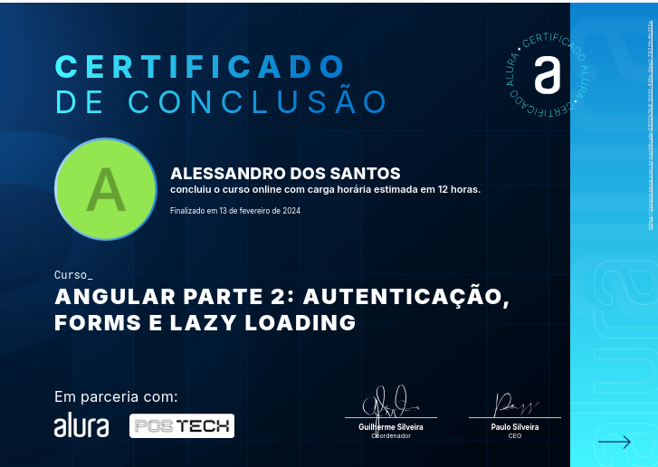

## Hi, I'm Alessandro 👋

I am a Full-Stack Software Developer with experience in creating scalable systems to meet the robust demands of large enterprises.

I have experience in object-oriented programming, working with languages such as ADVPL, TL++, Java, C#, TypeScript, JavaScript, and frameworks like Angular, Node.js, and React. My expertise includes REST and SOAP APIs, the application of Design Patterns, and best practices like SOLID and Clean Code. Additionally, I am proficient in SQL Server, Oracle, and Postgres databases, with advanced skills in queries and Stored Procedures, and I have foundational knowledge of MongoDB.

[My Resume](assets/resume.pdf)
<embed src="assets/resume.pdf" width="600" height="400" type="application/pdf">

## 🚀 About Me

- 🔭 I’m currently working on Totvs SA as a System Analyst.
- 🌱 I’m currently learning about microprogramming with React Native and Cloud with AWS
- 👯 I’m looking to collaborate on events as a volunteer.
- 💬 Ask me about software development, system analysis, scalable architecture, and data integration.
- 📫 How to reach me: https://www.linkedin.com/in/alessandros/
- 😄 Pronouns: He

## Education Background

**FIAP** - Postgradute Degree in Full Stack Development (2024-2025)
**AVM - Integrated Colleges** - Posgraduate in Business Management Systems (2014-2015)
**UMC - University of Mogi das Cruzes** - Bachelor's Degree in Information Systems (2004-2008)

## Certifications

- Java

  
  
  
  
  

- C#

  
    

- Node.js#

  
    

- Angular#

  
    

## Technical Skills

Languages Program

My top languages

| Rank | Languages |
| ---: | --------- |
|    1 | TL++      |
|    2 | Java      |
|    3 | C#        |
|    4 | Angular   |

Cloud Plataforms

My top Cloud Plataforms

| Rank | Languages |
| ---: | --------- |
|    1 | AWS       |

Database Management System

My top DDatabase Management System

| Rank | Languages  |
| ---: | ---------- |
|    1 | SQL Server |
|    2 | Oracle     |
|    3 | Postgres   |
|    4 | MySQL      |
|    5 | MongoDB    |

## Experience

- **Totvs SA** - System Analyst (Present Currently)

  - Skilled professional in project management, solution development, and integration maintenance via REST and SOAP APIs.
  - Extensive experience in product development, from the initial conception phase (UX) through ongoing maintenance. Engaged in key client interviews, coding, pilot tracking, and product upkeep. My integrated approach spans all stages of the project lifecycle, contributing to effective solutions aligned with market needs.

  - I create efficient connections between systems and services using ADVPL and TL++ languages, develop web applications through the Angular framework, and implement development practices that yield cohesive, loosely coupled, clean, and reusable code.

  - Responsible for the creation of unit and integration tests, both manual and automated, ensuring comprehensive coverage of desired functionality. I use appropriate testing requirements and tools, such as Jasmine and ADVPR.

  - Creation of comprehensive documentation and meticulous content validation to facilitate understanding for both end users and support teams.

  - Demonstrate autonomy and the ability to operate with minimal supervision, effectively collaborating with teams and departments. I perform supervision, code review, and delivery tracking within an agile, multidisciplinary team, prioritizing tasks, removing roadblocks, and delegating tasks efficiently.

  - I adopt a DevSecOps culture, utilizing the CI/CD pipeline for artifact maintenance and updates. My work is focused not only on solution development but also on continuous security and operational functionality.

- **BRITVIC EBBA** - System Analyst (2018 - 2019)

  - I worked in the analysis and development of customizations for the Protheus system using the ADVPL language: Entry Points, Functionalities, Facilitators, TMSPrinter Reports, TReport, SetPrint and Excel, Screens, ExecAuto, and WorkFlow.

  - Provided user support (inquiries and corrections), maintained the data dictionary, and performed load balancing. Supported modules included: Purchasing, Management Accounting, Inventory/Costing, Billing, Finance, and Human Resources Management.

- **Totvs SA** - System Analyst (2017 - 2018)

  - I was involved in the analysis and maintenance of system inconsistencies for the Protheus system, with an emphasis on the Retail module (SigaLoja, FrontLja, and TotvsPdv) using the ADVPL language. I participated in meetings and committees to define product innovations and high-impact adjustments.

  - I developed documentation and technical materials for the adjustments and improvements made. Responsible for ensuring the quality of the software delivery. Conducted training and provided internal support on improvements and system business rules.

  - I participated in the innovation and development of the Pdv Live Bematech x Protheus BackOffice integration.

- **Totvs SA** - ERP Consultant (2011 - 2016)

  - I was involved in the analysis, requirements gathering, and development of customizations, innovations, and maintenance for the Protheus system using the ADVPL language. I developed integrations between Totvs brands (Protheus, RM, and Bematech) via XML and WebServices using Unique Message, Entry Points, Reports (TMSPrinter, TReport, SetPrint, Excel), Screens, ExecAuto, and Workflow.

  Key Projects:

  - Integration between Protheus PDV and RM BackOffice.
  - Netshoes: Gathering information for system integrations, development of customizations and WebServices, and integration of Protheus with NewHotel via Unique Message (XML).
